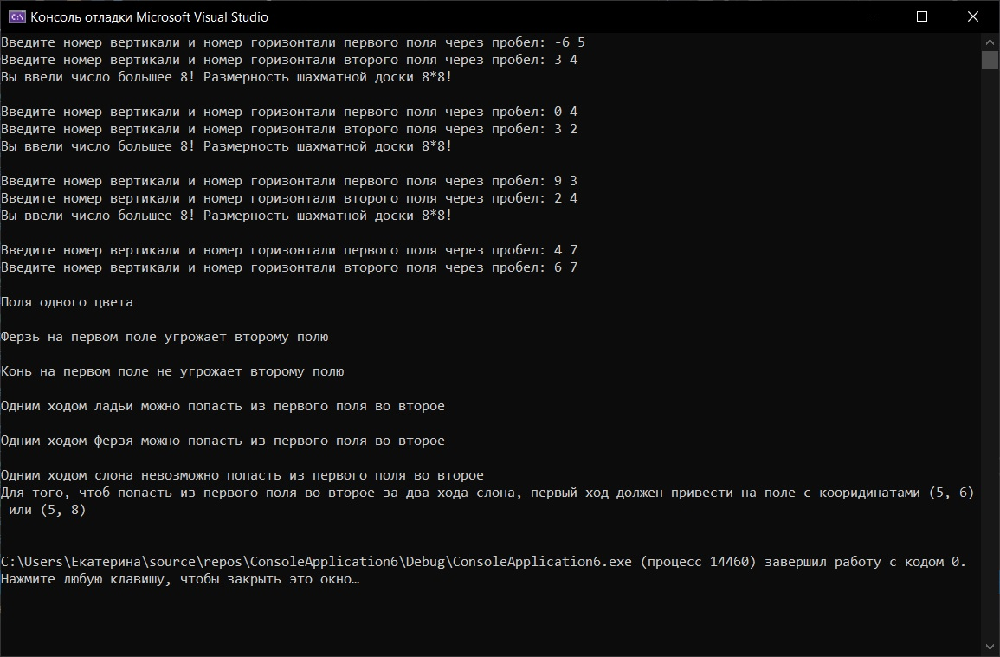
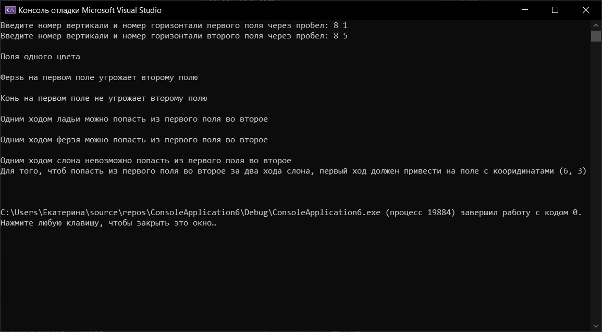
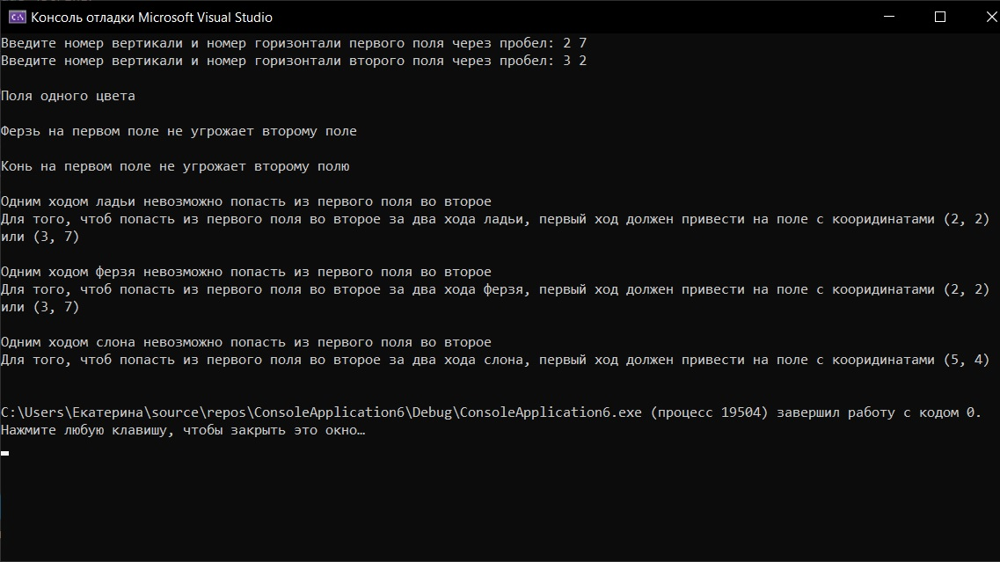
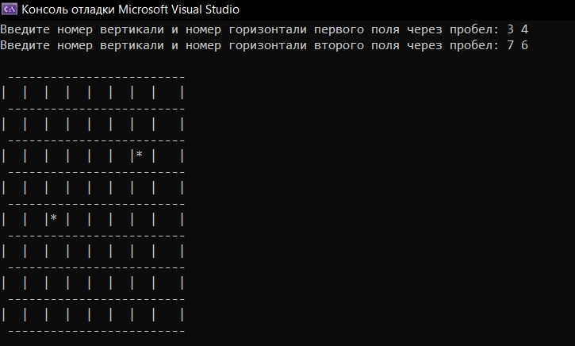

# practica3
1. Я написала на языке С++ программу, выполняющую данные задачи:
   а) Выяснить, являются ли поля (k, I) и (m, n) полями одного цвета. 
   6) На поле (к, I) расположен ферзь. Угрожает ли он полю (m, n)? 
   в) На поле (к, I) расположен конь. Угрожает ли он полю (m, n)?
   г) Выяснить, можно ли с поля (k, I) одним ходом ладьи попасть на поле (m, n). Если нет, то выяснить, как это можно сделать за два хода (указать поле, на которое приводит первый    ход). 
   д) Выяснить, можно ли с поля (k, I) одним ходом ферзя попасть на поле (m, n). Если нет, то выяснить, как это можно сделать за два хода (указать поле, на которое приводит первый    ход).
   е) Выяснить, можно ли с поля (k, I) одним ходом слона попасть на поле (m, n). Если нет, то выяснить, как это можно сделать за два хода (указать поле, на которое приводит первый    ход). 

2. При успешном запуске высветится консоль, в которую будет необходимо ввести: пару натуральных чисел (координат клеток на шахматной доске), каждое из которых не превосходит          восьми: первое число— номер вертикали (при счете слева направо), второе— номер горизонтали (при счете снизу вверх). Затем происходит вывод описания возможных задач и способов      их реализации.Программа завершает свою работу.

   Вот листинг теста программы:
   
   Илюстрирует проверку введенного числа на пренадлежность промежутку от 1 до 8 и случай, когда возможно перемещение  слона по диагонали вправо.
   
   
   Случай, когда возможно перемещение слона по диагонали влево.
   
   
   Случай, когда возможно перемещение слона по диагонали вправо.
   
   
   Отобразить доску и отметить на ней выбранные поля:
   
   
3. Необходимо открыть файл программы ConsoleApplication6.cpp. Её запуск  осуществляется в среде разработки, в нашем случае в Visual Studio. Его можно осуществить с помощью горячих    клавиш ctrl+F5 или с помощью меню: выбрать в строке    меню Сборка -> пункт Собрать решение, Отладка -> пункт Запуск без отладки. 
